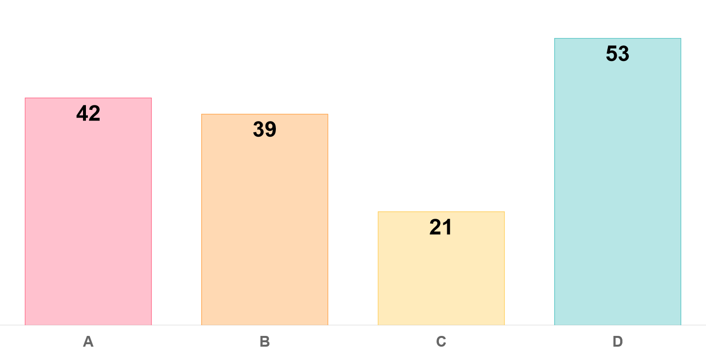
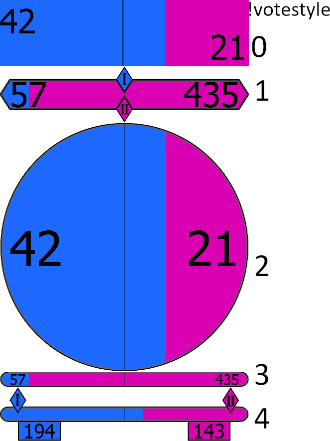
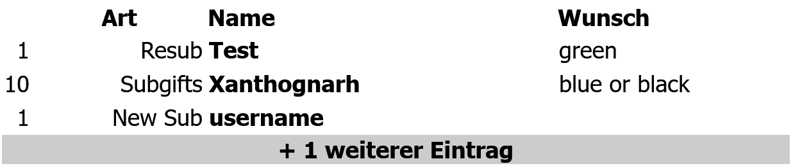

# WebWidgets
A collection of Tools for more interaction with your Twitch chat. The tools can be embedded very easily in OBS as a browser source. No login or account required.
1. [ChatSurvey](#chatsurvey)
2. [Chat12](#chat12)
3. [Sublist](#sublist)
4. [Overlay](#overlay)

General Information:
- Config via URL: Use the base url `https://xanthognarh.github.io/WebWidgets/`+Tool+`.htm?channel=`+Channelname and add optional parameters like `&parameter1=value1&parameter2=value2`
- Use a . for decimal numbers (not a ,) 
- Chat commands with multiple parameters need to have the exact amount of spaces, as defined. [Parameters] are optional, but if you want to use the last parameter, all parameters before has to be used, Tool.
- You can customize the style by providing custom css to OBS
- If you want to change the commands (or any other changes), you need your own webserver (local is possible e. g. `python -m http.server 80`) with the htm-file and the Script-folder.
Search the htm-file for `<script>`. In the lines below you find the definition of the commands. They don't need to start with an ! as the tool only checks if the string matches the chat message.
Search for `if (user.mod || user['display-name']=="Xanthognarh" || user['display-name'].toLowerCase()==TwitchChannel.toLowerCase()){` and change `Xanthognarh` to any username you want to permit (beside of the mods).

Take a look at an [alternative version by DasCleverle](https://github.com/DasCleverle/stream-widgets)

## ChatSurvey
Reads the chat of a Twitch channel and interprets messages consisting of numbers (e.g. “1”, “2”, “3”) as votes. The voting result is displayed as a bar chart. Only the first number of each user is accepted until a new vote is started. 

### Config via URL-Parameters:
- `channel`: Name of Twitch Channel you want to listen
- `min`: lowest accepted value for vote [default=1]
- `max`: highest accepted value for vote [default=5]
- `bg`: r,g,b,a value  for the background-color (0-255) and alpha (0-1) [default: transparent (0,0,0,0)]
- `hidden`: 0: Not hidden or 1: hidden when loading the page. Visibility can be changed by chat commands. [default=0]

You can click on the plot to open/close the config editor or edit the values manually. Embed the link like: `https://xanthognarh.github.io/WebWidgets/ChatSurvey.htm?channel=Channelname&min=1&max=5&bg=50,70,100,0.3`

### Chat Commands:
- `!newvote`: Resets votes and user blocklist, shows the chart
- `!newvote min-max`: Resets votes and user blocklist, shows the chart and set range. Example for negative values: `!newvote -3--1`; Min/Max can be letters (case-insensitive)
- `!stopvote`: Disables new entries (freeze the current view)
- `!continuevote`: Allows new entries, old votes are still valid and the old user blocklist will be used. 
- `!voteagain`: Allows all users to submit new votes. These votes are added to the old votes.
- `!hidevote`: Changes the visibility of the chart. Votes will be still counted.
- `!showvote`: Changes the visibility of the chart. Votes will be still counted.

### Feature Ideas
- `!vote Text` e.g. Names

## Chat12
Reads the chat of a Twitch channel and interprets the messages "1" and "2" as votes. The voting result is displayed as a bar with a marker at the center. Only the first number of each user is accepted until a new vote is started. After a given time the votes are resetted and the bar hidden. A new vote is automatically triggerd by new voting messages in chat.

### Config via URL-Parameters:
- `channel`: Name of Twitch Channel you want to listen
- `to`: Approximate time in seconds after the last vote to reset the voting [default=30]
- `minvotes`: Necessary amount of votes to display the bar [default=3]
- `c1`: r,g,b,a value  for the background-color (0-255) and alpha (0-1) [default: blue (29,105,253,1)]
- `c2`: r,g,b,a value  for the background-color (0-255) and alpha (0-1) [default: pink (217,1,177,1)]
- `stats`: 0: Not displayed or 1: Number of votes displayed [default=0]
- `fontsize`: Value between 0-100, if ≤50: Left text top, right text bottom [default=50]
- `style`: Choose a predefined design (0-4) [default=0]
- `debug`: Allow multiple votes per user

Embed the link like: `https://xanthognarh.github.io/WebWidgets/Chat12.htm?channel=Channelname&to=10`

### Chat Commands:
- `!resetvote`: Resets votes and user blocklist
- `!disablevote`: Disables new votes and hide the bar
- `!enablevote`: Allows new votes
- `!votestyle style`: Change the design
- `!votetitle Title`: Set a Title/Question

The bar is invisible during an ongoing ChatSurvey-Vote (from !newvote to !hidevote).

## Sublist
Shows a list of Subs/Bits for future interaction. The listet users can display a message using `!pick message`. After a timeout or `!RemoveUser username` this entry is removed. If there are multiple entries of one user, only the first entry will be removed.

### Config via URL-Parameters:
- `channel`: Name of Twitch Channel you want to listen
- `len`: max Number of Entries displayed [default=5]
- `bitprice`: Amount of Bits that equals 1 [default=300]
- `subprice`: Amount of Subs that equals 1 [default=1]
- `maxmessage`: max length of Message to be displayed [default=30]
- `showtype`: 0: Hide the column with the Sub/Resub/Bit 1: Show the column [default=1]

Embed the link like: `https://xanthognarh.github.io/WebWidgets/sublist.htm?channel=channelname&len=3` 
If you want a background-color add this custom CSS in OBS: `table{background-color:rgba(255,255,255,0.4)}`
### Chat Commands:
- `!pick message`: Command for the person shown in table to send a Message
- `!pick username message`: Mod command to send a message instead
- `!AddUser username [amount][type]`: Add username to the queue, amount and type can be empty
- `!RemoveUser username [Pos=0]`: Removes the pos-th entry of the given user
- `!ShowType`: Shows the column with the Sub/Resub/Bit info
- `!HideType`: Hides the column with the Sub/Resub/Bit info

### Feature Ideas
- `!Purgeuser`: Remove all entries of this user
- Sub Tiers have different value
- Localization

## Overlay
Allows mods to display an overlay with custom text at a custom position. Set the browser source to fullscreen.

### Config via URL-Parameters:
- `channel`: Name of Twitch Channel you want to listen
- `c1`: r,g,b,a value  for the background-color (0-255) and alpha (0-1) [default: black (0,0,0,0.7)]
- `c2`: r,g,b,a value  for the font-color (0-255) and alpha (0-1) [default: white (255,255,255,1)]
- `font`: see below 
- `pos`: pos [offset-x] [offset-y] value for the default position (pos Number 1-9 from Numpad) and optionally offset by the given values in pixel.
- `userallowlist`: comma-separated (no spaces) list of all users beside broadcaster, that are allowed to edit the overlay. If not used, every mod is allowed.

Embed the link like: `https://xanthognarh.github.io/WebWidgets/Overlay.htm?channel=Channelname&c1=0,0,0,0.7&c2=255,255,255,1`

### Chat Commands:
- `!overlay Content`: Display an overlay with the content
- `!showoverlay`: Shows the overlay
- `!hideoverlay`: Hides the overlay
- `!overlaypos pos [offset-x] [offset-y]`: Moves the overlay to pos (Number 1-9 from Numpad) and optionally offset by the given values in pixel. Pos 0 hides the background.
- `!overlayscale scale`: Scale the overlay [default: 1]
- `!overlaycolor background [font]`: Set the color using CSS Color values e. g. #RRGGBBAA #RRGGBB rgba(255,255,255,1) blue. Use "-" as background to change only font color.
- `!overlayfont font`: Set the font-family. Use " for font names with spaces. You can add fallback fonts (e. g. `!overlayfont Georgia, "Times New Roman", serif`). Use `!overlayfont 1-6` to use a font from this list:
["Helvetica","'Times New Roman'","'Segoe UI'","'Courier New'","'Brush Script MT'","'Papyrus'"]

You can create a table by using "|" to divide the cells and "\\" for a new row. Start Text with "!!" to span the cell over the row.
Twitch Emotes are possible.

### Alternativ to this tool
A more convenient way for overlays could be MS PowerPoint or Google Slides. The method described here has the flaw to show (anti-aliasing?) contures and doesn't allow transparency.
1. Open PowerPoint/Slides and copy a Share-Link with editing permission
2. Paste this link in an OBS Browser Source
3. Set width/heigt to fullscreen (e. g. 1920x1080)
4. (Use custom css to remove background - if anyone achieved this, please let me know how!)
5. Add a relative crop filter with values 382/190/130/98 for MS or 322/132/102/106 for Google
6. Add a luma key with values 1/0/0/0
7. Add a scale filter to the size of your canvas
8. Change the background-color of the slides to black and don't use the black color for anything (use a very dark gray)

To reduce the contures, you could increase the step 3 resolution (and update the step 5 values when using MS).