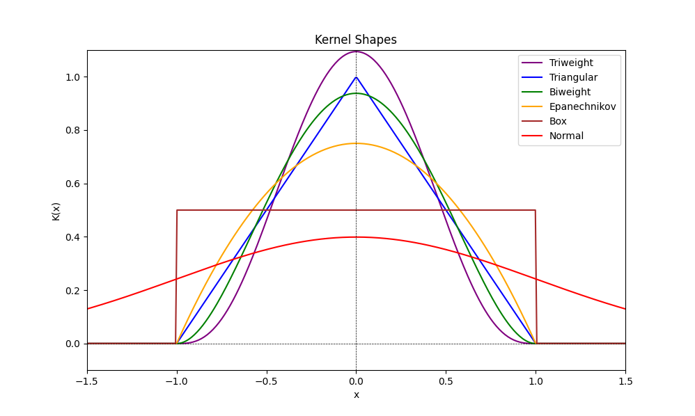

# WebWidgets
**WebWidgets** is a collection of interactive tools designed to enhance your Twitch chat experience. These tools can be effortlessly embedded into OBS as a browser source, requiring no login or account. Below is a detailed overview of each tool included in this collection.

## Table of Contents
1. [ChatSurvey](#chatsurvey)
2. [ChatStat](#chatstat) (Still in development)
3. [Chat12](#chat12)
4. [Sublist](#sublist)
5. [Overlay](#overlay)
6. [PDF-Overlay](#PDF-Overlay)

---

## General Information

- **Configuration via URL**: Use the base URL `https://xanthognarh.github.io/WebWidgets/` + Tool + `.htm?channel=` + Channelname, adding optional parameters such as `&parameter1=value1&parameter2=value2`.
- Use a period (`.`) for decimal numbers (not a ,) 
- **Chat Commands**: Commands with multiple parameters must have the exact number of spaces defined. [Parameters] are optional; if the last parameter is used, all prior parameters must be included as well.
- **Customization**: You can provide custom CSS for style modifications directly in OBS.
- **Hosting Your Own Version**: To modify commands or make other changes, host your own web server (local options like `python -m http.server 80` are possible) with the HTML file and script folder. Search the HTML for `<script>` tags to find command definitions directly below; Commands don't have to start with `!`. To permit specific user include them in const extraMods=[];

---

## ChatSurvey
ChatSurvey reads Twitch chat messages and interprets numbers (e.g., “1”, “2”, “3”) as votes, displaying results as a bar chart. Only the first number from each user is accepted until a new voting round starts.

Config via URL-Parameters:

- `channel`: Name(s) of the Twitch channels to listen to (supports Shared Chat).  Separate Channels with comma.
- `min`: Lowest accepted value for vote [default: 1]
- `max`: Highest accepted value for vote [default: 5]
- `bg`: Background color as r,g,b (0-255) and alpha (0-1). [default: transparent (0,0,0,0)]
- `hidden`: 0: Not hidden or 1: Hidden during page load (visibility can change via chat commands). [default: 0]
- `debug`: Allow multiple votes per user, commands can be used by everyone.

You can click on the plot to open/close the config editor or edit the values manually. Embed the link like: `https://xanthognarh.github.io/WebWidgets/ChatSurvey.htm?channel=Channelname&min=1&max=5&bg=50,70,100,0.3`

Chat Commands:

- `!newvote`: Reset votes and user blocklist, show the chart.
- `!newvote min-max`: Reset votes and user blocklist, show the chart and set range. Example for negative values: `!newvote -3--1`; Min/Max can be letters (case-insensitive).
- `!resetvote`: Alias for `!newvote` (shared command with Chat12)
- `!stopvote`: Disable new entries (freeze the current view)
- `!continuevote`: Allow new entries, old votes are still valid and the old user blocklist will be used. 
- `!voteagain`: Allow all users to submit new votes. These votes are added to the old votes.
- `!hidevote`: Change the visibility of the chart (votes still counted).
- `!showvote`: Change the visibility of the chart (votes still counted).

### Feature Ideas
- `!vote Text` e.g. Names

## ChatStat (Still in Development)
Reads the chat of a Twitch channel and interprets messages consisting of numbers (e.g. “1”, “2”, “3”) as votes. The voting result is displayed as a KDE chart. Only the first number of each user is accepted until a new vote is started. 

What is a KDE Chart?

A KDE (Kernel Density Estimation) Chart is useful for showing how values are spread out, especially with continuous numbers. Unlike a regular bar chart that only counts whole numbers (like 1, 2, 3, or 4), a KDE Chart gives a smoother estimate of the votes.

Think of it like the game “Connect Four”: when you place a piece in the fourth column, instead of just adding one piece there, you also add a little bit to the columns on either side, the third and fifth columns. This means that votes that are close together (like 13 and 15) can affect each other. But if most votes are close, the chart can show these smaller differences (like 13 and 13.5) clearly.
That start is a clear and engaging introduction! Here's a polished version that flows well into the kernel explanations:

The way you add small amounts to the left and right of the vote is called the **Kernel**. You can change the kernel shape with the command `!setkernel`. 
Think of “Connect Four.” You could add the same amount of pieces to the left and right; this is the **Box Kernel**. Alternatively, you might add them in a triangular fashion, like 1-2-1 or even 1-2-3-2-1, which represents the **Triangular Kernel**. Choose between those kernel shapes:
- **Normal**: Bell-shaped curve ⁔ that is smooth and balanced, making it best for votes that clusters evenly around a central value like people's average estimates.
- **Epanechnikov**: Parabolic shape ⋂ that highlights the center while considering nearby values, which is good when most responses are around a central estimate allowing for slight variations.
- **Biweight**: Rounded shape ⋏ that gives more weight to values near the center while still acknowledging some variation. It is useful when many estimates are similar, making it easy to see common opinions.
- **Triweight**:  Similar to Biweight but with a sharper peak ⋏, providing a very smooth appearance with less influence from outliers. It is ideal for a clear peak in estimates with little variation around it.
- **Box**: Flat and uniform shape ⨅ that treats all values equally. This is effective when responses vary widely, ensuring no estimate is weighted more than another.
- **Triangular**: Simple triangle shape ⋀ that quickly emphasizes central values, making it good for quick surveys to show a general trend without detailing every estimate.

The width of the kernel on either side of a vote is controlled by the command `!seth width`. This parameter, known as bandwidth (h), affects how smooth or rough the KDE Chart appears. A smaller bandwidth shows more detail and highlights variations, while a larger bandwidth results in a smoother chart.

To handle potential trolling or outlier votes, you can automatically adjust the range of displayed values with the command `!setp percent`. Setting it to 0% uses no data, while 100% includes everything. For example, using `!setp 90` will show the most relevant parts of the votes while ignoring the 10% extreme values. At 100 votes, the 5 lowest and 5 highest votes are not displayed.

Config via URL-Parameters:

- `channel`: Name(s) of the Twitch channel(s) to monitor (supports Shared Chat). Separate channels with a comma.
- `kernel`: Kernel of the KDE Plot. Choose one of [Normal, Epanechnikov, Box, Biweight, Triweight, Triangular]  [default: normal]
- `bg`: Background color as r,g,b (0-255) and alpha (0-1). [default: white-transparent (230,230,255,0.8)]
- `axiscolor`: r,g,b,a value  for the axis-color (0-255) and alpha (0-1) [default: black (0,0,0,1)]
- `linecolor`: r,g,b,a value  for the line-color (0-255) and alpha (0-1) [default: black (0,0,0,1)]
- `fillcolor`: r,g,b,a value  for the fill-color (0-255) and alpha (0-1) [default: blue-transparent (50,50,255,0.5)]
- `hidden`: 0: Not hidden or 1: Hidden during page load (visibility can change via chat commands). [default: 0]
- `bandwidth`: Fixed value for the bandwith (h) [default: auto]
- `debug`: Allow multiple votes per user; commands can be accessed by everyone.

Embed the link like: `https://xanthognarh.github.io/WebWidgets/ChatStat.htm?channel=Channelname&debug=1`

Chat Commands:

- `!newvote KDE`: Reset votes and user blocklist, then display the chart.
- `!resetvote`: Alias for `!newvote` (shared command with Chat12)
- `!stopvote`: Disable new entries (freeze the current view).
- `!continuevote`: Allow new entries; old votes remain valid with the previous user blocklist. 
- `!voteagain`: Permit all users to submit new votes; these are added to old votes.
- `!hidevote`: Change the visibility of the chart; votes will still be counted.
- `!showvotekde`: Update the visibility of the chart; votes will still be counted.
- `!setkernel`:  Change the kernel of the KDE Plot. Choose one of [Normal, Epanechnikov, Box, Biweight, Triweight, Triangular]
- `!seth width`: Set the width (bandwidth h); if no number is provided, h is estimated.
- `!setp percent`: Set the displayed percentile, skipping the lowest and highest values. 0: No data used, 100: All data used.
- `!limit min-max`: Set the range of displayed values; if no min or max is provided, it is unlimited.
- `!testdata n [modes max digits]`: Generate n random votes with specified modes [default: 2], from 0 to max [default: 100]; results rounded to digits [default: 2].
Use negative values for n to load example test data (-1,...,-25). 

## Chat12
Chat12 reads messages from a Twitch channel and interprets "1" and "2" as votes. The voting results are visualized as a bar with a central marker. Only the first vote from each user is accepted until a new vote begins. After a set period, the votes are reset, and the bar is hidden. A new voting round is automatically triggered by new voting messages in the chat.

For an alternative version, check out [DasCleverle's implementation](https://github.com/DasCleverle/stream-widgets)

Config via URL-Parameters:

You can use the [Chat12-config Editor](https://xanthognarh.github.io/WebWidgets/Chat12-config.htm) to modify your overlay and get an link to embed. 
Or you modify the url manually:

- `channel`: Name(s) of the Twitch channel(s) to monitor (supports Shared Chat). Separate multiple channels with a comma.
- `to`: Approximate time in seconds after the last vote for resetting voting [default: 30]
- `minvotes`: Minimum number of votes required to display the bar [default: 3]
- `c1`: r,g,b,a value  for the background-color (0-255) and alpha (0-1) [default: blue (29,105,253,1)]
- `c2`: r,g,b,a value  for the background-color (0-255) and alpha (0-1) [default: pink (217,1,177,1)]
- `stats`:  0: Not displayed; 1: Display number of votes [default: 0]
- `fontsize`: Font size value between 0-100. If ≤50: Left text top, right text bottom [default: 50]
- `style`: Choose a predefined design (0-4) [default: 0]
- `debug`: Allow multiple votes per user; commands can be used by everyone.

Embed the link like: `https://xanthognarh.github.io/WebWidgets/Chat12.htm?channel=Channelname&to=10`

Chat Commands:

- `!hidevote`: Reset votes and user blocklist and hide the bar (shared command with ChatSurvey, but without background voting)
- `!resetvote`: Reset votes and user blocklist (shared command with ChatSurvey); like `!hidevote` 
- `!disablevote`: Disable new votes until `!enablevote` and hide the bar.
- `!enablevote`: Allow new votes.
- `!votestyle style`: Change the design. Append 00 (e.g., `!votestyle 100`) for hidden voting.
- `!votetitle Title`: Set a Title/Question

The bar is deactivated during an ongoing ChatSurvey vote (from `!newvote` to `!hidevote`).

## Sublist
Shows a list of Subs/Bits for future interaction. The listet users can display a message using `!pick message`. After a timeout or `!RemoveUser username` this entry is removed. If there are multiple entries of one user, only the first entry will be removed.

Config via URL-Parameters:

- `channel`: Name of Twitch Channel(s) you want to listen (also works for Shared Chat). Separate Channels with comma.
- `len`: max Number of Entries displayed [default: 5]
- `bitprice`: Amount of Bits that equals 1 [default: 300]
- `subprice`: Amount of Subs that equals 1 [default: 1]
- `maxmessage`: max length of Message to be displayed [default: 30]
- `showtype`: 0: Hide the column with the Sub/Resub/Bit 1: Show the column [default: 1]

Embed the link like: `https://xanthognarh.github.io/WebWidgets/sublist.htm?channel=channelname&len=3` 
If you want a background-color add this custom CSS in OBS: `table{background-color:rgba(255,255,255,0.4)}`

Chat Commands:

- `!pick message`: Command for the person shown in table to send a Message
- `!pick username message`: Mod command to send a message instead
- `!AddUser username [amount][type]`: Add username to the queue, amount and type can be empty
- `!RemoveUser username [Pos=0]`: Remove the pos-th entry of the given user
- `!ShowType`: Show the column with the Sub/Resub/Bit info
- `!HideType`: Hide the column with the Sub/Resub/Bit info

### Feature Ideas
- `!Purgeuser`: Remove all entries of this user
- Sub Tiers have different value
- Localization

## Overlay
Allows mods to display an overlay with custom text at a custom position. Set the browser source to fullscreen.

Config via URL-Parameters:

- `channel`: Name of Twitch Channel you want to listen
- `c1`: r,g,b,a value  for the background-color (0-255) and alpha (0-1) [default: black (0,0,0,0.7)]
- `c2`: r,g,b,a value  for the font-color (0-255) and alpha (0-1) [default: white (255,255,255,1)]
- `font`: see below 
- `pos`: pos [offset-x] [offset-y] value for the default position (pos Number 1-9 from Numpad) and optionally offset by the given values in pixel.
- `userallowlist`: comma-separated (no spaces) list of all users beside broadcaster, that are allowed to edit the overlay. If not used, every mod is allowed.
- `debug`: Commands can be used by everyone

Embed the link like: `https://xanthognarh.github.io/WebWidgets/Overlay.htm?channel=Channelname&c1=0,0,0,0.7&c2=255,255,255,1`

Chat Commands:

- `!overlay Content`: Display an overlay with the content
- `!showoverlay`: Show the overlay
- `!hideoverlay`: Hide the overlay
- `!overlaypos pos [offset-x] [offset-y]`: Move the overlay to pos (Number 1-9 from Numpad) and optionally offset by the given values in pixel. Pos 0 hides the background.
- `!overlayscale scale`: Scale the overlay [default: 1]
- `!overlaycolor background [font]`: Set the color using CSS Color values e. g. #RRGGBBAA #RRGGBB rgba(255,255,255,1) blue. Use "-" as background to change only font color.
- `!overlayfont font`: Set the font-family. Use " for font names with spaces. You can add fallback fonts (e. g. `!overlayfont Georgia, "Times New Roman", serif`). Use `!overlayfont 1-6` to use a font from this list:
["Helvetica","'Times New Roman'","'Segoe UI'","'Courier New'","'Brush Script MT'","'Papyrus'"]

You can create a table by using "|" to divide the cells and "\\" for a new row. Start Text with "!!" to span the cell over the row.
Twitch Emotes are possible.

### Alternativ to this tool
A more convenient way for overlays could be MS PowerPoint or Google Slides. The method described here has the flaw to show (anti-aliasing?) contures and doesn't allow transparency.
1. Open PowerPoint/Slides and copy a Share-Link with editing permission
2. Paste this link in an OBS Browser Source
3. Set width/heigt to fullscreen (e. g. 1920x1080)
4. (Use custom css to remove background - if anyone achieved this, please let me know how!)
5. Add a relative crop filter with values 382/190/130/98 for MS or 322/132/102/106 for Google
6. Add a luma key with values 1/0/0/0
7. Add a scale filter to the size of your canvas
8. Change the background-color of the slides to black and don't use the black color for anything (use a very dark gray)

To reduce the contures, you could increase the step 3 resolution (and update the step 5 values when using MS).

## PDF-Overlay
The PDF-Overlay tool displays a PDF file as an overlay. To select the PDF file, you must enter interactive mode in OBS and click anywhere on the page. Then you can close the interactive mode.

Config via URL-Parameters:

- `channel`: Name(s) of the Twitch channels you want to monitor (supports Shared Chat). Separate channels with a comma.

Embed the link like: `https://xanthognarh.github.io/WebWidgets/pdfoverlay.htm?channel=channelname`

Chat Commands:

- `!hidepdf`: Hide the pdf.
- `!showpdf`: Show the pdf.
- `!pdf+ [amount]`: Turn to the next page.
- `!pdf- [amount]`: Turn to the previous page.
- `!pdf page`: Jump to a specific page.
- `!pdfrotation angle`: Rotate page to angle [0, 1, 90, 2, 180, 3, 270]
- `!pdfzoom percent`: Scale the PDF to the specified percentage of its maximum display size from 0 and 100.
- `!pdfpos pos [offset-x] [offset-y]`: Move the overlay to pos (Number 1-9 from Numpad) with optional pixel offsets. Pos 0 hides the background.
- `!pdfcrop`: Reset cropping.
- `!pdfcrop top right bottom left`: Crop the PDF by specified percentages for each side.

You can also use the [PDF Config Preview](https://xanthognarh.github.io/WebWidgets/pdfoverlay-config.htm) to preview your changes and send them all in one command with `!pdfconfig`.

